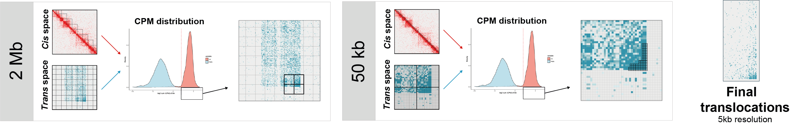
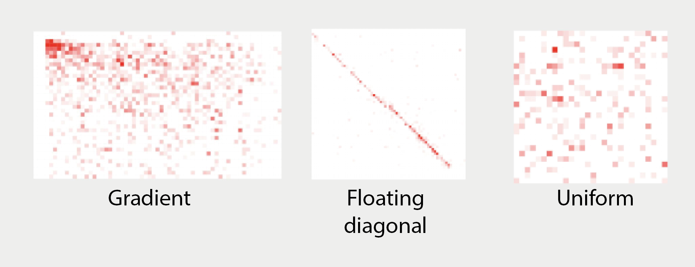

# Translocation Finder

A tool for detecting and classifying genomic translocations from H3K27ac HiChIP `.hic` files.

## Table of Contents

- [About](#about)
- [Requirements](#requirements)
- [Usage](#usage)
- [Pipeline Overview](#pipeline-overview)
- [Output](#output)

---

## About

**Translocation Finder** identifies regions of abnormal chromatin interaction, both interchromosomal (trans) and long-range intrachromosomal (cis), from HiChIP data. Starting from the full genome space, the pipeline progressively refines candidate regions across three tiling rounds (2 Mb → 200 kb → 50 kb), then corrects tile borders and classifies each event into one of three patterns:

- **Gradient:** indicating a translocation, starts with a strong signal (comparable to cis diagonal) that diffuses outwards. 
- **Floating diagonal:** signal enriched along a definite diagonal axis.
- **Uniform:** strong uniform signal.




<!-- ### Publication -->

## Local installation prerequisites

- Linux-based operating system (Ubuntu 18.04+ or similar)
- R (version 4.0.0+) with the following packages:
  - `strawr`, `ggplot2`, `tidyr`, `dplyr`, `dbscan`, `parallel`, `doParallel`, `foreach`, `data.table`
- [AQuA Tools](https://github.com/axiotl/aqua-tools) (specifically `annotate_loops.sh` and `list_samples.sh`)
- Access to `.hic` files registered in the AQuA Tools sample list


## Usage

```bash
bash translocation_finder.sh \
  -A SAMPLE_NAME \
  -G GENOME_BUILD \
  -S GENOME_SIZE \
  -O OUT_DIR
```

| Option | Description |
|--------|-------------|
| `-A` | Sample name as it appears in the AQuA Tools sample list |
| `-G` | Genome build (e.g. `hg38`) |
| `-S` | Full path to a 2-column `.txt` file with chromosome sizes (`chr`, `size`) |
| `-O` | Full path to the output directory |


## Pipeline Overview

The bash wrapper runs three scripts in sequence:

### 1. `get_tiles.r`
Tiles the genome progressively at 2 Mb, 200 kb, and 50 kb resolution to identify candidate translocation regions. At each round, cis tiles (adjacent 2 Mb diagonal pairs) and trans tiles (interchromosomal pairs, plus intrachromosomal pairs ≥ 3.5 Mb from the diagonal) are annotated with summed CPM counts from the `.hic` file via `annotate_loops.sh`. Tiles whose log2 CPM exceeds a threshold derived from the cis contact distribution are retained as candidates for the next round. Surviving 50 kb tiles are merged into translocation blocks using DBSCAN, with each block spanning the coordinate range of its constituent tiles.

### 2. `fix_tiles.r`
Recovers translocations that fall on tile edges by expanding each block 100 kb outward in each of the four directions at 5 kb resolution. If the maximum contact count in the expanded region exceeds the maximum within the original block, the boundary is moved outward to that pixel. Rows and columns that are entirely zero after expansion are trimmed, yielding precise final coordinates.

### 3. `classify_tiles.r`
Classifies each tile into one of three categories based on the spatial pattern of Hi-C contacts, extracted at 5 kb resolution. Three features are computed using a 5 × 5 sliding window: maximum local density (fraction of non-zero pixels in the window), variance of local densities, and a separation score (difference between the mean of the top 3 counts in the highest-density window and the mean of the bottom 3 counts in the lowest-density window).

| Class | Criteria |
|-------|----------|
| **Gradient** | Maximum local density ≥ 0.7; or between 0.5–0.7 with log2 separation score > mean + 1 SD |
| **Floating diagonal** | Gradient tiles where the ratio of diagonal-to-total contact sum is high, as determined by k-means (2 centers) on a per-tile floating-diagonal score |
| **Uniform** | All remaining tiles |



---

## Output

All outputs are written under `OUT_DIR/`:

```
OUT_DIR/
├── results/
│   ├── <sample>_translocation-blocks_50KB_merged.bedpe
│   ├── <sample>_translocation-blocks_50KB_merged_fixed.bedpe
│   └── <sample>_translocation-blocks_50KB_merged_fixed_classified.bedpe  ← final output
├── plots/
│   └── *.pdf
└── intermediates/
    └── *.bedpe
```

The final output is a BEDPE file with a `class` column indicating `gradient`, `uniform`, or `floating_diagonal` for each translocation event.